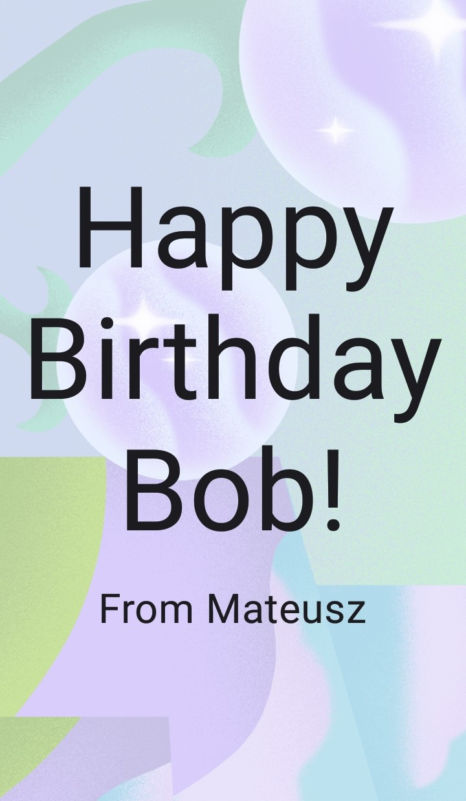

# Birthday Card App

This repository hosts the Birthday Card App, a simple yet elegant Android application developed as part of my coursework for the [Android Basics with Compose](https://developer.android.com/courses/android-basics-compose/course). The app displays a customisable birthday greeting, demonstrating the basic yet powerful features of Jetpack Compose in Android development.

## Project Overview

The Birthday Card App serves as a practical application of the Kotlin programming skills and Jetpack Compose techniques I learned during the course. It features a user-friendly interface that showcases a personalised birthday message. The primary goal of this project was to create a visually appealing application while practicing fundamental development skills.

## App Screenshot

  

This is a screenshot of the Birthday Card App, showcasing the default view of the birthday greeting interface. This image provides a visual representation of the app’s user interface developed using Jetpack Compose.

## Learning Outcomes

Through the development of this app, I achieved several key learning outcomes:

- **Applied Kotlin Fundamentals**: Integrated basic Kotlin concepts, such as variables, functions, and control structures, to build the app's functionality. The foundational code can be viewed in my [Kotlin Practice repository](https://github.com/mateusss6/KotlinPractice.git).
- **Utilised Jetpack Compose**: Employed Jetpack Compose to design and implement the app's user interface. This modern toolkit simplified the process of building a cohesive and responsive UI, enhancing the overall user experience.
- **Deployment on Android Devices**: Successfully configured and deployed the app on an Android device, which involved compiling the app, handling APK files, and troubleshooting common deployment issues. This step was crucial for testing the app in a real-world environment.

## Features

- **Customisable Greeting Message**: Users can personalise the birthday message displayed on the card, making it versatile for different recipients.
- **Scalable UI**: The design adjusts gracefully across different Android devices, ensuring a consistent look and feel.

## How to Use

To explore and run the Birthday Card App:
1. Clone this repository to your local machine.
2. Open the project in Android Studio.
3. Sync the project with Gradle.
4. Run the app on an emulator or connect an Android device via USB for direct deployment.

## Future Enhancements

Looking ahead, I plan to add the following features:
- Integration with a calendar API to automatically send birthday greetings.
- Option to customie the background and font styles of the card.

Thank you for visiting the Birthday Card App repository! Your feedback and contributions to improving the app are greatly appreciated.
